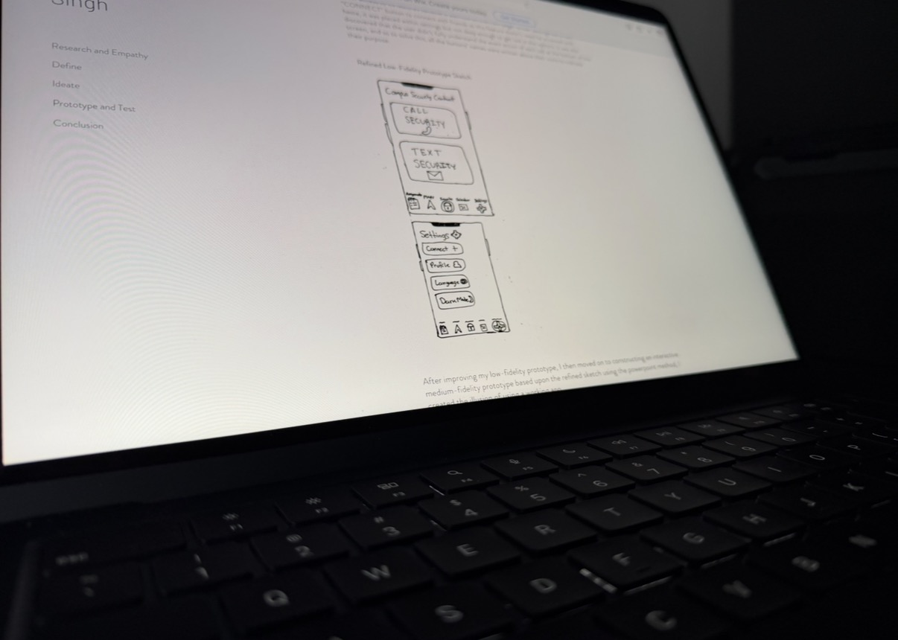

# Health & Wellbeing

Over the five years since graduating, I have made my health a much bigger priority in my life, by staying consistent with going to the gym and have developing healthier habits that I have been able to maintain even while working a full time job.

I have also gotten better at balancing my career with my personal life, by making more time for sleep, hobbies, friends, and family instead of allowing work and other responsibilities to take up all of my time. I did this by finding a routine that allowed me to work toward my goals while still making time to enjoy my life.
