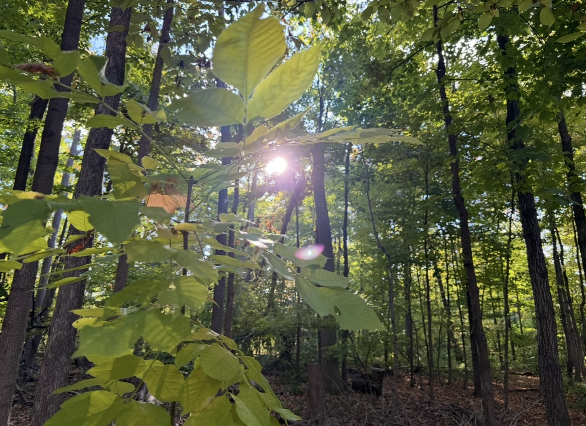

# Adventure & Exploration

Over the five years since graduating, I have made an effort to experience more of the world and step outside of my usual routine. I have traveled to new places, experienced different cultures, and made memories with my friends and family that I will always remember.

I have also become more comfortable trying new things and exploring places on my own instead of always waiting for the perfect opportunity. I did this by pushing myself to take more chances and say yes to new experiences, which is how I made some of my favourite memories. 
