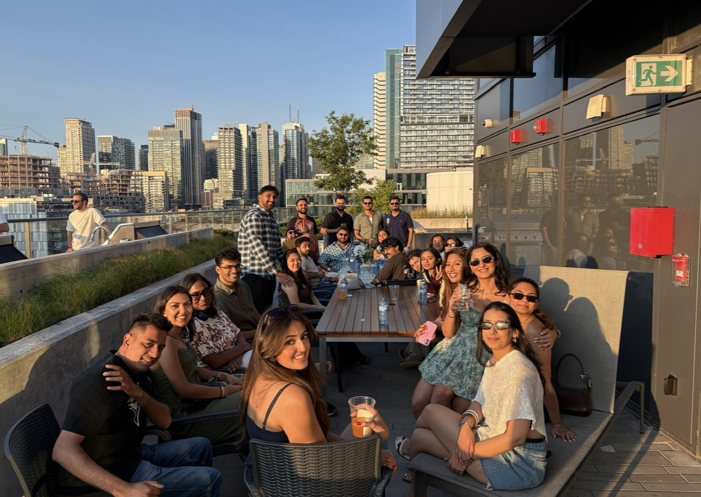

# Personal Growth & Relationships

Over the five years since graduating, I have become more confident, independent, and comfortable with who I am as a person. I have learned how to handle more responsibilities on my own and have become better at managing my time between my career, personal life, and the people who are important to me.

I have also made an effort to maintain strong relationships with my friends and family while meeting new people along the way, and I have become a better communicator and have learned how important it is to make time for the people I care about, even when life gets busy. I feel like I have grown a lot as a person and have surrounded myself with people who have had a positive impact on my life and hopefully help me continue to grow.
